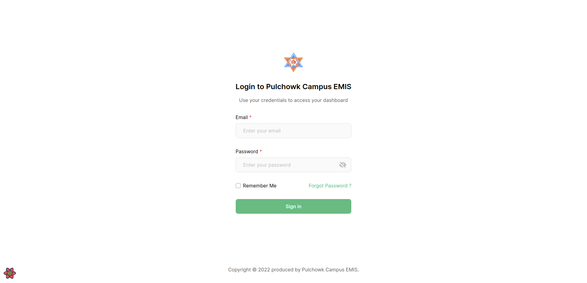

### Pulchowk Campus EMIS

This repository contains code for the EMIS system for Pulchowk Campus.

### Run Locally

- Clone the repository on your local machine

- Go into the project folder root and install the requirements

  ```sh
  yarn add
  ```

- While the dependencies get installed, create a file name '.env.local' in the root of the project with the contents as below:
  ```sh
  BACKEND_API_URL=http://localhost:8000/api/
  ```

#### Project Members

- **Arpan Pokharel** (075BCT015)
- **Chirag Lamsal** (075BCT032)
- **Bibek Basyal** (075BCT097)
- **Saugat Kafle** (075BCT099)

#### Project Preview




[More about this project](https://www.bibekbasyal.com.np/project/pulchowk-emis)
